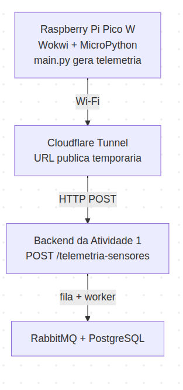

# Atividade 2 - Firmware De Telemetria Com Raspberry Pi Pico W

## Contexto

Esta entrega expande a arquitetura implementada na Atividade 1 com um cliente
embarcado capaz de enviar telemetrias ao backend já existente.

Na Atividade 1, o sistema foi estruturado com:

- backend HTTP em NestJS
- fila RabbitMQ para desacoplamento
- worker para consumo assíncrono
- persistência em PostgreSQL

Nesta Atividade 2, o objetivo foi integrar um Raspberry Pi Pico W para atuar
como origem das telemetrias. 

Com isso, a solução implementada nesta pasta usa um Pico W simulado no Wokwi,
gera leituras aleatórias de sensores analógicos e digitais e envia essas
telemetrias para o backend da Atividade 1 via HTTP.

## Referencia Para A Atividade 1


- [Repositório da Atividade 1](/home/inteli/ponderadas/aula_murilo/README.md)
- [Link do Wokwi](https://wokwi.com/projects/459776518753677313)


## Tecnologias utilizadas

Nesta entrega foi utilizado:

- `MicroPython`
- simulador `Wokwi`
- `Raspberry Pi Pico W`
- `cloudflared tunnel` para expor o backend local na internet durante os testes

## Descricao Da Solucao

O firmware implementado em [main.py](./main.py) executa as seguintes etapas:

1. conecta o Pico W ao Wi-Fi
2. verifica continuamente se a conectividade foi mantida
3. gera payloads aleatórios para sensores analógicos e digitais
4. envia os dados ao endpoint `POST /telemetria-sensores`
5. faz retry em caso de falha de transmissão

O payload enviado ao backend segue o contrato atualmente aceito pela Atividade 1:

```json
{
  "idDispositivo": 99,
  "tipoSensor": "temperatura",
  "naturezaLeitura": "analogica",
  "valorColetado": "24.70"
}
```

O `backend` complementa o registro com:

- `horaColeta`
- `jobId`

## Descricao Dos Sensores Integrados

Nesta versao da atividade, os sensores foram simulados por software dentro do
Wokwi. Portanto, nao ha sensores fisicos conectados em GPIOs reais nesta
entrega.

### Sensores analogicos simulados

| Sensor | Tipo | GPIO utilizado | Faixa esperada |
|---|---|---|---|
| temperatura | analogico | nao se aplica | `18.00` a `36.00` |
| umidade | analogico | nao se aplica | `30.00` a `90.00` |
| luminosidade | analogico | nao se aplica | `100.00` a `1000.00` |
| vibracao | analogico | nao se aplica | `0.00` a `12.00` |

### Sensores digitais simulados

| Sensor | Tipo | GPIO utilizado | Valores esperados |
|---|---|---|---|
| presenca | digital | nao se aplica | `presenca` ou `ausencia` |
| porta | digital | nao se aplica | `aberto` ou `fechado` |
| bomba | digital | nao se aplica | `ligado` ou `desligado` |
| alarme | digital | nao se aplica | `ligado` ou `desligado` |

## Configuracao De Rede

As configuracoes principais do firmware ficam no topo de [main.py](./main.py):

```python
NOME_WIFI = "Wokwi-GUEST"
SENHA_WIFI = ""
URL_BACKEND = "http://physician-pages-artist-blue.trycloudflare.com/telemetria-sensores"
ID_DISPOSITIVO = 99
INTERVALO_DE_ENVIO = 10
```

### Exposicao Do Backend Com Cloudflared Tunnel

Durante os testes, o backend da Atividade 1 foi executado localmente e exposto
para acesso externo por meio de um `cloudflared tunnel`.

Objetivo dessa etapa:

- permitir que o Pico W simulado no Wokwi acessasse um backend rodando na
  maquina local
- evitar a necessidade de publicar a aplicacao em um servidor externo apenas
  para demonstracao

Fluxo utilizado:

<div align="center">
<p><strong>Figura 1 - Fluxo com CloudFlared</strong></p>
        
        <br />
<p><em>Fonte: O autor (2026)</em></p>
</div>


## Instrucoes De Execucao Do Firmware

Como esta entrega usa `MicroPython`, a execucao nao envolve uma compilacao
tradicional. O processo consiste em carregar o arquivo `main.py` no ambiente do
Pico W simulado.

### Opcao 1 - Wokwi Web

1. Copiar o prjeto no seguinte link do [Wokwi](https://wokwi.com/projects/459776518753677313)
4. ajustar `NOME_WIFI`, `SENHA_WIFI` e `URL_BACKEND`
5. iniciar a simulacao


## Diagrama De fluxo

Como os sensores estao simulados por software, o diagrama abaixo representa a
topologia logica da solucao e nao uma ligacao fisica de componentes externos.

<div align="center">
<p><strong>Figura 2 - Diagrama De fluxo</strong></p>
        
        <br />
<p><em>Fonte: O autor (2026)</em></p>
</div>

## Evidencias De Funcionamento

As evidencias desta entrega serao anexadas em video, em vez de prints soltos,
para consolidar a demonstracao completa do fluxo.

### Video de Demonstração

[Link do video](https://canva.link/i22et7cvz4upi86)


